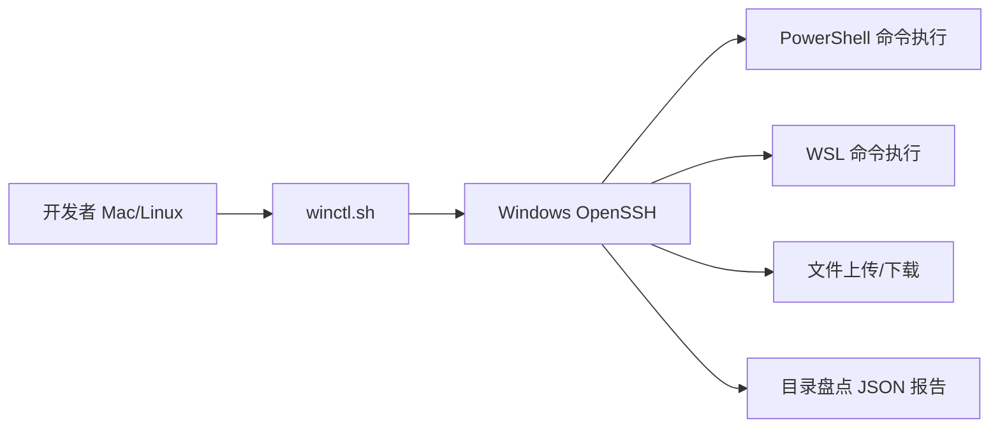
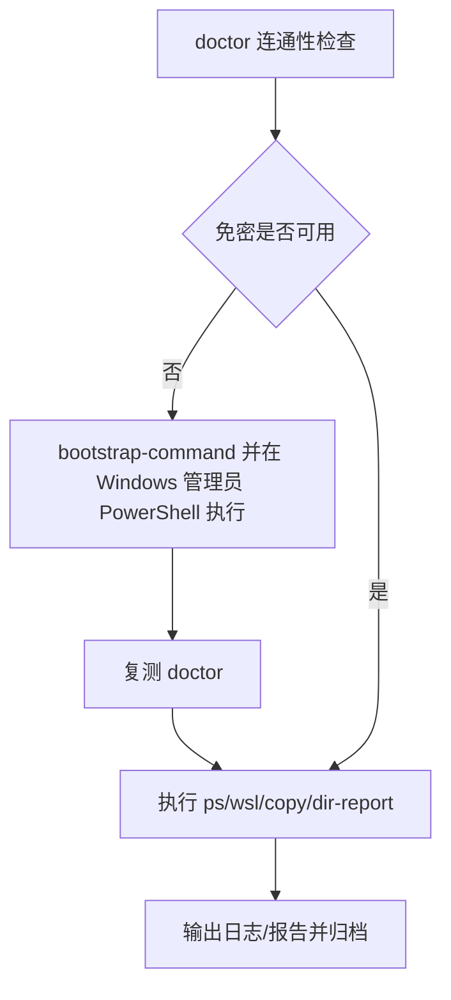

# Windows SSH Control Skill

> 通过 SSH 标准化远程控制 Windows 主机（PowerShell / WSL / 文件传输 / 目录盘点）

**维护单位：芯寰云（上海）科技有限公司**

## 项目定位

`windows-ssh-control` 是一个面向通用 AI 编程助手/Agent 的通用 Skill 项目，用于把跨机 Windows 控制流程固化为可复用命令。

核心目标：

1. 快速建立 Mac/Linux -> Windows 的 SSH 控制链路
2. 统一远程执行 PowerShell 与 WSL 命令
3. 标准化双向文件传输
4. 输出结构化目录盘点报告（JSON）

## 系统架构（图）



## 使用环境说明

| 运行模式 | 说明 | 执行端 | 推荐度 |
|---|---|---|---|
| Windows 本机初始化模式 | 首次开启 OpenSSH、配置公钥、修复 ACL | Windows 管理员 PowerShell | 高（一次性） |
| Mac/Linux 控制 Windows 模式 | 日常远程执行命令、传输文件、目录盘点 | Mac/Linux 终端 | 高（推荐） |
| 跨机设备联调模式 | Mac 编排 -> Windows 执行 -> 设备链路 | Mac/Linux + Windows | 中高（联调场景） |

## 能力矩阵

| 能力 | 说明 | 命令 |
|---|---|---|
| 连通性与免密检查 | 探测主机可达、端口可达、免密可用 | `doctor` |
| 授权脚本生成 | 生成 Windows 管理员侧一键配置脚本 | `bootstrap-command` |
| 远程 PowerShell | 执行 Windows 原生命令 | `ps` |
| 远程 WSL | 执行 WSL shell 命令 | `wsl` |
| 文件上传 | 本地 -> Windows | `copy-to` |
| 文件下载 | Windows -> 本地 | `copy-from` |
| 目录盘点 | 递归统计目录规模、类型分布、大文件/最近变更 | `dir-report` |

## 快速开始

### 1. 配置目标机器参数（可选）

```bash
export WIN_USER=Administrator
export WIN_HOST=192.168.1.100
export SSH_PORT=22
```

### 2. 先做诊断

```bash
./scripts/winctl.sh doctor
```

### 3. 若未完成免密，生成并在 Windows 管理员 PowerShell 执行

```bash
./scripts/winctl.sh bootstrap-command
```

### 4. 常用操作（示例均为占位路径）

```bash
# PowerShell
./scripts/winctl.sh ps "hostname; whoami; Get-Date"

# WSL
./scripts/winctl.sh wsl "uname -a && whoami"

# 文件传输
./scripts/winctl.sh copy-to ./local.txt "C:/Temp/local.txt"
./scripts/winctl.sh copy-from "C:/Temp/report.txt" ./report.txt

# 目录报告
./scripts/winctl.sh dir-report "D:/workspace/sample-project" 20
```

## 标准执行流程（图）



## 目录结构

```text
windows-ssh-control-skill/
├── SKILL.md
├── README.md
├── LICENSE
├── agents/openai.yaml
└── scripts/
    ├── winctl.sh
    ├── windows-dir-report.sh
    └── setup_ssh_trust.ps1
```

## 环境变量说明

| 变量 | 默认值 | 说明 |
|---|---|---|
| `WIN_USER` | `Administrator` | Windows SSH 登录用户名 |
| `WIN_HOST` | `192.168.1.100` | Windows 主机地址 |
| `SSH_PORT` | `22` | SSH 端口 |
| `KEY_PATH` | `~/.ssh/windows_ssh_control_ed25519` | 私钥路径 |
| `KNOWN_HOSTS_FILE` | `~/.ssh/known_hosts` | 主机指纹文件 |

## 目录盘点报告字段（JSON）

| 字段 | 含义 |
|---|---|
| `generated_at` | 报告生成时间 |
| `exists` | 目标路径是否存在 |
| `target_path` | 解析后的目标目录 |
| `summary` | 目录/文件数量与体积统计 |
| `top_level` | 顶层目录项快照 |
| `extension_top` | 文件后缀分布 TopN |
| `subdir_size_top` | 子目录体积 TopN |
| `largest_files` | 最大文件 TopN |
| `recent_files` | 最近变更文件 TopN |

## 与 QuecPython Skill 组合

你可以将本项目与 `quecpython-dev-skill` 组合，实现跨机设备调试闭环：

1. 本机生成与校验代码
2. SSH 下发到 Windows
3. Windows 侧执行部署/串口测试
4. 拉回日志做判定

参考：
- [QuecPython Dev Skill](https://github.com/LiteChipCloud/quecpython-dev-skill)

## 安全与运维建议

1. 建议使用专用 SSH 密钥，不复用个人高权限私钥
2. 为 Windows 目标机配置固定 IP 或可靠 DNS
3. 生产环境优先使用非管理员账户并做最小权限授权
4. 对 `copy-to` / 远程执行操作保留审计日志
5. 对批量命令先小范围验证再全量执行

## 开源许可证

本项目采用 `Apache-2.0`，详见 `LICENSE`。

## 社区治理

1. 安全策略：`SECURITY.md`
2. 贡献指南：`CONTRIBUTING.md`
3. 社区行为规范：`CODE_OF_CONDUCT.md`
4. 归因声明：`NOTICE`
5. CI 门禁：`.github/workflows/ci.yml`
