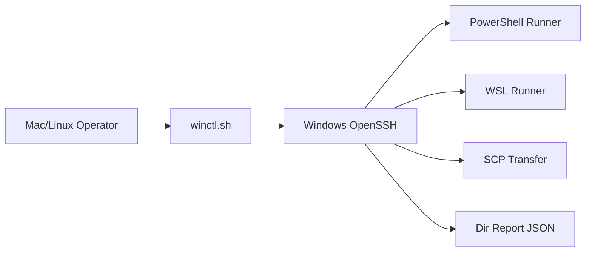

# 01 控制链路架构设计

## 1. 设计目标

1. 统一跨机控制入口，避免临时命令散乱。
2. 把 PowerShell / WSL / 文件传输统一抽象在一个命令面。
3. 提供稳定可解析的目录盘点输出。

## 2. 架构图

## 3. 命令层级

| 层级 | 命令 | 说明 |
|---|---|---|
| 健康检查 | `doctor` | 检查主机可达、端口、免密 |
| 授权辅助 | `bootstrap-command` | 生成 Windows 侧初始化脚本 |
| 远程执行 | `ps` / `wsl` | 执行原生命令 |
| 传输 | `copy-to` / `copy-from` | 双向文件传输 |
| 盘点 | `dir-report` | 输出结构化目录报告 |

## 4. 设计边界

1. 本 Skill 不替代 CMDB 或资产系统。
2. 本 Skill 不内置凭据托管能力。
3. 默认聚焦单机控制，批量编排由上层系统负责。
