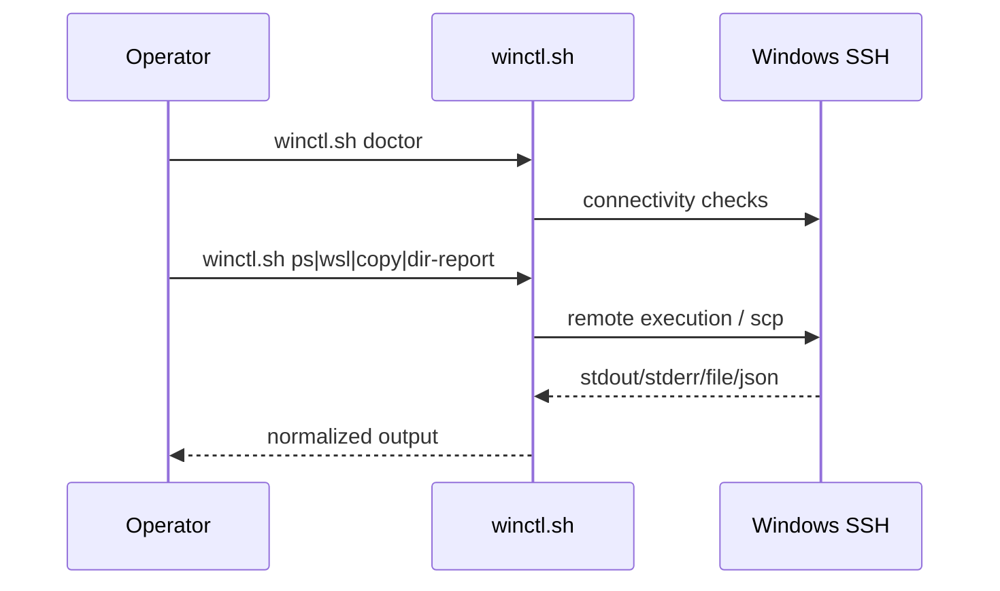

# 02 命令执行与文件传输模型

## 1. 执行流程

## 2. 命令语义

| 命令 | 输入 | 输出 | 失败信号 |
|---|---|---|---|
| `ps` | PowerShell 语句 | 标准输出文本 | 非零退出码 |
| `wsl` | Linux shell 语句 | 标准输出文本 | 非零退出码 |
| `copy-to` | 本地文件 + 远端路径 | 成功确认 | 文件不存在/权限错误 |
| `copy-from` | 远端文件 + 本地路径 | 成功确认 | 远端路径错误/权限错误 |
| `dir-report` | 目录路径 + TopN | JSON 报告 | 目录不存在/解析失败 |

## 3. 输出稳定性策略

1. `dir-report` 优先输出 JSON，避免自然语言漂移。
2. 报告字段保持向后兼容，新增字段采用非破坏式扩展。
3. 错误输出尽量保留原始系统错误，便于复现问题。

## 4. 失败处理建议

1. 先执行 `doctor` 再执行业务命令。
2. 失败后优先重试只读命令确认连接状态。
3. 文件类命令失败先检查路径风格（Windows 路径分隔与转义）。
